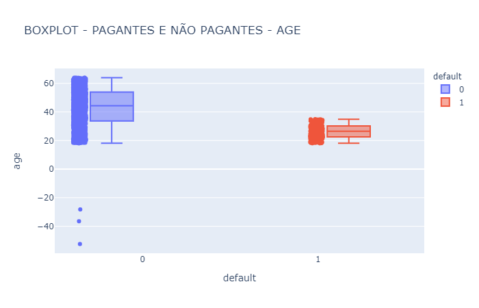
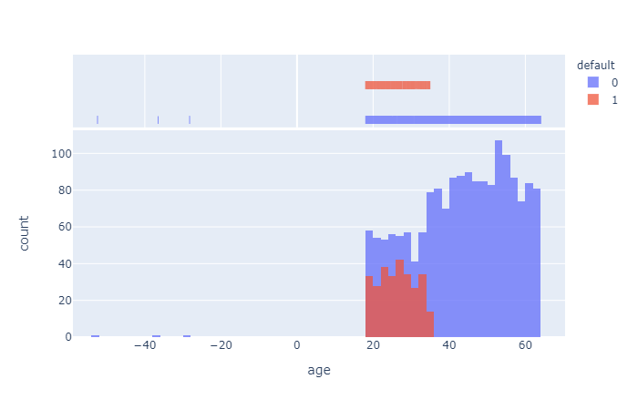
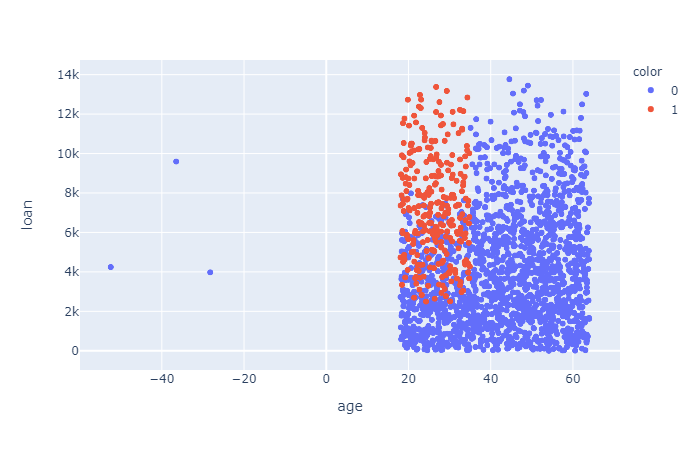

<h1 align="center">
    
</h1>

<h4 align="center"> 
	🚧 MACHINE LEARNING - CLASSIFICAÇÃO - BASE DE CRÉDITO - EMPRÉSTIMOS 1.0 🚀 em desenvolvimento... 🚧
</h4>

  

  

  	
  
	
  
  

  
   

## 💻 Sobre o projeto

📦 **MACHINE LEARNING - CLASSIFICAÇÃO - BASE DE CRÉDITO - EMPRÉSTIMOS** é um projeto de machine learning para classificação de clientes que solicitam empréstimos.

O dataset contém os dados:

Quantidade de dados: **2000 clientes**

| Variável | Tipo | O que é |
|--|--|--|
| cliente id | int64 | Identificação do cliente |
| income     | int64 | Renda anual do cliente |
| age | float64 | Idade do cliente |
| loan | float64 | Quantidade de empréstimo solicitada |
| default | int64 | Coluna binária dizendo se pagou ou não o empréstimo solicitado |

## 📈 Resultados

<h1 align="center">
    
</h1>

O boxplot mostra que há três valores de idade outliers, no caso:

- age < 0

O tratamento ocorre na seção: Tratamento das idades negativas.

<h1 align="center">
    
</h1>

O gráfico acima mostra que os clientes não pagantes possuem idades menores (mais jovens) que os clientes pagantes.

<h1 align="center">
    
</h1>

O gráfico acima reforça a importância da variável idade, para identificar um cliente não pagante (default = 1), independentemente do valor de empréstimo solicitado.

## 🛠  Tecnologias

As seguintes ferramentas foram usadas na construção do projeto:

- [Python]

## ♤♠♧♣  Passos

 - **Importação dos dados** - O dataset está no diretório ./BASES
 - **Análise Exploratória**
	- *Valores Faltantes*
	- *Proporção de clientes pagantes e não pagantes*
	- *Boxplot de renda dos clientes*
		- *Quartis - Pagantes*
		- *Quartis - não Pagantes*
	- *Boxplot das idades dos clientes*
	- *Histograma das idades dos clientes*
- **Pré-Processamento**
	- *Retirando valores nulos*
	- *Tratamento dos valores inconsistentes - Idade*
		- *Usando IQR*
	- *Escalonização dos dados*
		$$ StandardScaler = \frac{X - Mean(X)}{std(X)} $$
- **Modelo - Regressão Logística (Logistic Regression)**
	- *Train Test Split*
	- *Fit - Predict*
	- *Avaliando o modelo*
		- *Classification Report*

## 🚀 Como executar o projeto

1. **Instalando**: pip install -r requirements.txt
2. **Execução do jupyter**: 'CLASSIFICAÇÃO - BASE DE CRÉDITO.ipynb'

## ➊ Pré-requisitos

Antes de começar, você vai precisar ter instalado em sua máquina as seguintes ferramentas (O download pode ser realizado pela própria página do Python ou Anaconda):
[Python](https://www.anaconda.com/products/individual).

## 📝 Licença

Este projeto está sob a licença MIT.

Feito com ❤️ por **Emerson Rafael** 👋🏽 [Entre em contato!](https://www.linkedin.com/in/emerson-rafael/)

[Python]: https://www.python.org/downloads/